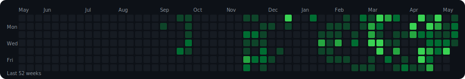

<!--
GitHub Profile README (dynamic widgets)

Tip: This README is intended for the special repo named exactly your username.
-->

<table>
<tr>
<!-- ================= LEFT PANEL ================= -->
<td width="32%" valign="top">

<h2>Charles Shaju</h2>

<b>@charles-shaju</b>

IoT | Embedded Systems | AI | Robotics

<h3>About Me</h3>

Passionate about <b>IoT</b>, <b>Embedded Systems</b>, <b>AI</b>, and <b>Robotics</b>. 
Currently building innovative solutions using cutting-edge technologies. 
Exploring ways to integrate AI and robotics into IoT systems. 
Always learning, experimenting, and contributing to open-source projects. 
Feel free to check out my repositories and connect.

<h3>Socials</h3>

<h3>Quick Info</h3>
<ul>
<li>Education: Rajagiri College of Social Science</li>
<li>Location: Kalamassery, Cochin, Kerala</li>
<li>Website: https://charles-shaju.github.io/</li>
</ul>
</td>

<!-- ================= RIGHT PANEL ================= -->
<td width="68%" valign="top">

<h2 style="margin:0;">Welcome to Charles Shaju's Hub</h2>

Explore my open source contributions and projects

Powered by GitHub

<!-- ====== STATS TILES (dynamic, black) ====== -->

<!-- ====== CONTRIBUTIONS (GitHub-style grid) ====== -->

<h3 style="margin:0;">Contributions</h3>

<!-- ====== TECH STACK & LANGUAGES ====== -->

<h3 style="margin:0;">Tech Stack &amp; Languages</h3>

<b>Self-Learner</b> | <b>ML Enthusiast</b> | <b>Python</b>

<b>Core Technologies</b>

<!-- ====== EXTRA STATS ====== -->

<!-- ====== NOTABLE PROJECTS ====== -->
<h3>Notable Projects</h3>
<table width="100%" style="border-collapse:collapse;">
<tr>
<td width="50%" valign="top" style="padding:7px;">
<a href="https://github.com/charles-shaju/Intelligent-Voice-Assistant" style="display:block;text-decoration:none;color:inherit;">

Intelligent-Voice-Assistant

A intelligent voice assistant that uses TensorFlow to identify commands and run actions.

</a>
</td>
<td width="50%" valign="top" style="padding:7px;">
<a href="https://github.com/charles-shaju/neuralintents" style="display:block;text-decoration:none;color:inherit;">

neuralintents

A simple interface for working with intents and chatbots.

</a>
</td>
</tr>
<tr>
<td width="50%" valign="top" style="padding:7px;">
<a href="https://github.com/charles-shaju/OBM-IoT" style="display:block;text-decoration:none;color:inherit;">

OBM-IoT

No description available for this repository.

</a>
</td>
<td width="50%" valign="top" style="padding:7px;">
<a href="https://github.com/charles-shaju/Smart_Altimeter" style="display:block;text-decoration:none;color:inherit;">

Smart_Altimeter

Smart IoT Altimeter with precise MSL measurement.

</a>
</td>
</tr>
<tr>
<td width="50%" valign="top" style="padding:7px;">
<a href="https://github.com/charles-shaju/Graphical-LLP" style="display:block;text-decoration:none;color:inherit;">

Graphical-LLP

No description available for this repository.

</a>
</td>
<td width="50%" valign="top" style="padding:7px;"></td>
</tr>
</table>

If any widget is rate-limited, it usually fixes itself after a bit.
</td>
</tr>
</table>
