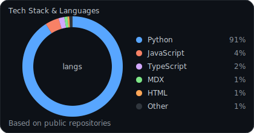

<!--
GitHub Profile README (dynamic widgets)

Single-column layout avoids horizontal scrolling on profile pages.
-->

<h2 style="margin:0;">Welcome to Charles Shaju's Hub</h2>

Explore my open source contributions and projects

 

<h3 style="margin:0;">Live Stats</h3>

 

<table width="100%" style="width:100%;table-layout:fixed;border-collapse:collapse;">
<tr>
<td width="50%" valign="top" style="padding:6px;">

<h3 style="margin:0;">Tech Stack &amp; Languages</h3>

Top languages from public repositories

</td>
<td width="50%" valign="top" style="padding:6px;">

<h3 style="margin:0;">Streak</h3>

</td>
</tr>
</table>

 

Pinned repositories and contribution activity are shown below by GitHub automatically.

If any widget is rate-limited, it usually fixes itself after a bit.
